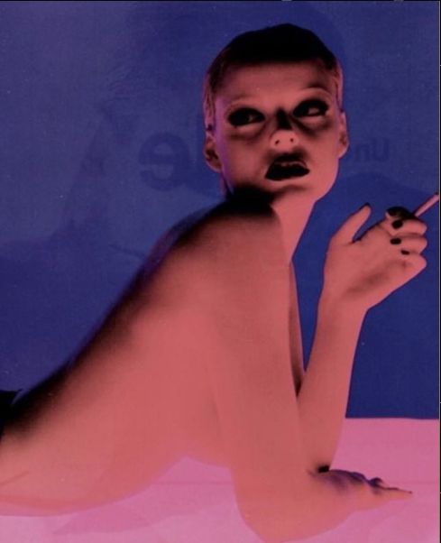
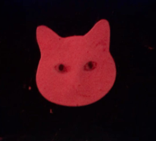
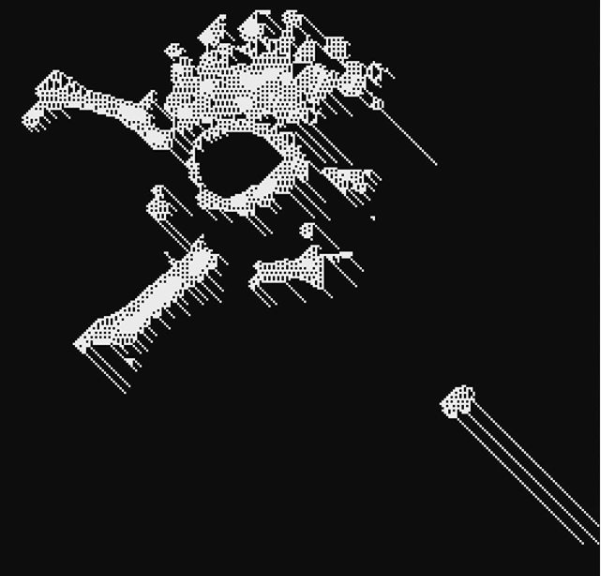
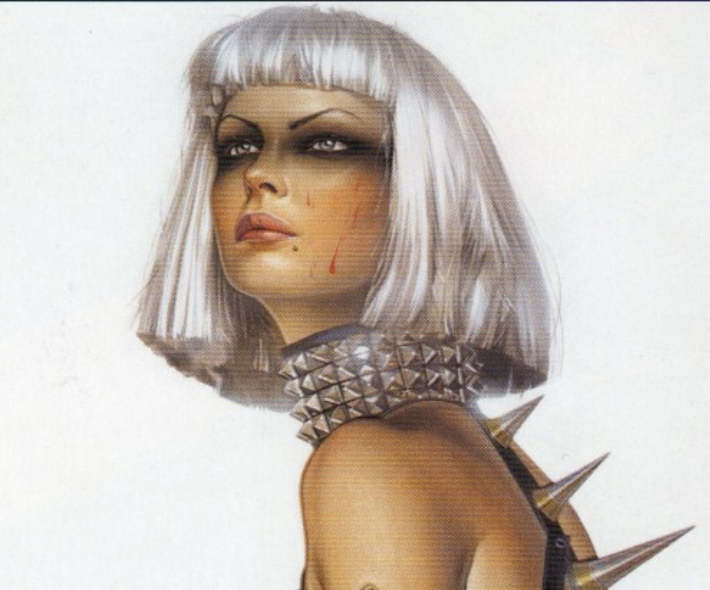

# PAD1
placeholder for Post Apocalyptic Dreams 1

## manifesto

* dreams are not fantasies, they're just another mode of reality
* dreams are not projections for a future, they're an expansion of the present
* minds/bodies (as one thing) can be infected with ideas/substances (as one thing)
* we want to rid our bodymind of the substanceidea of the future
* we want to kill the future and with it the present and past

## stetics

we put heavy weight (reliance) on stetics, since we don't believe in ultimate essences, 
superficialities play a central role in concrete affection in the instant moment

(some refs from https://www.instagram.com/sheetnoise/)

some tunes on stetics: https://soundcloud.com/plastic0cruel/sets/h4x0r-n1ght